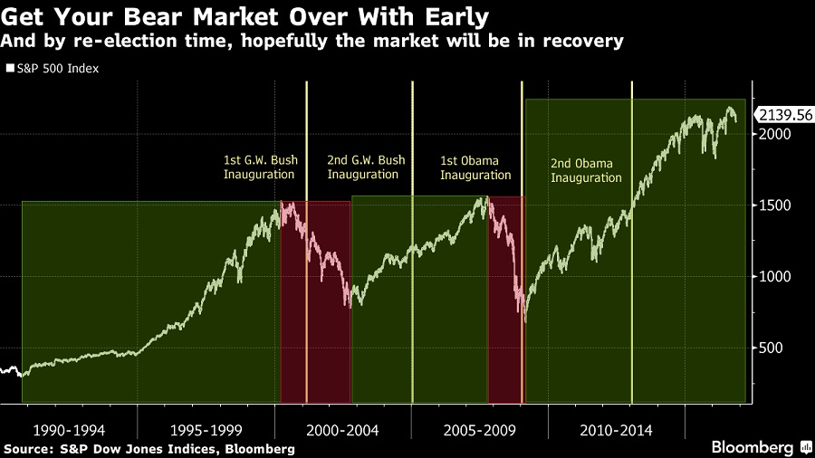
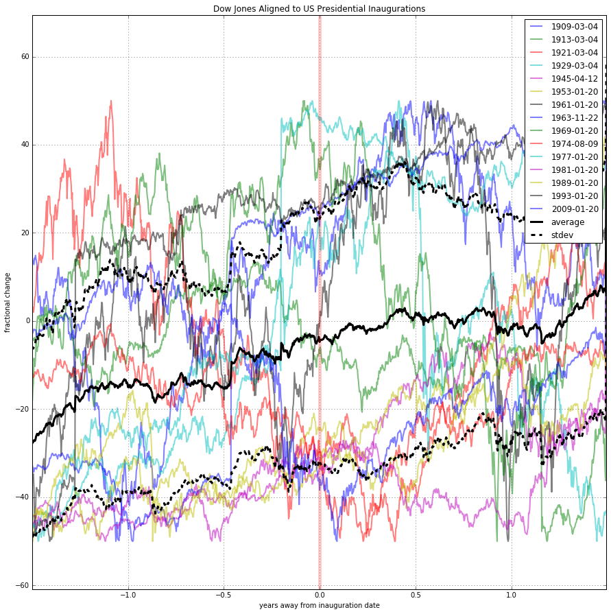
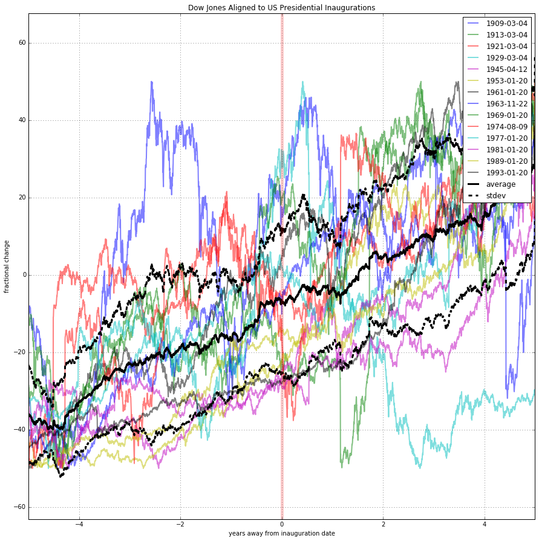
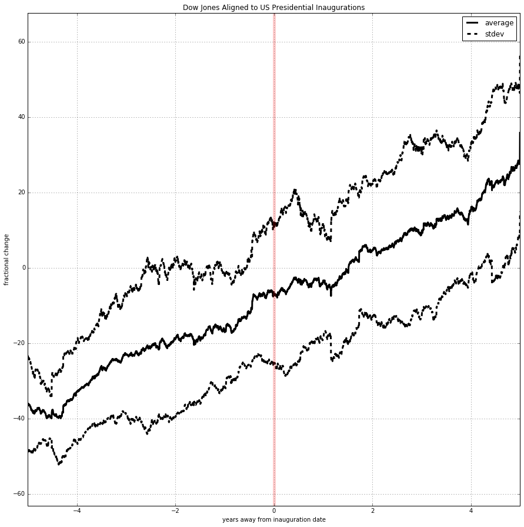

**description:** [test.py](test.py) downloads histocal daily Dow Jones Industrial Average closing values back to the early 1900s using my [quandl](https://www.quandl.com/tools/python) API key then aligns them with a list of us presidential inauguration dates obtained from [a website](http://historyinpieces.com/research/presidential-inauguration-dates) I found.

**normalization: ** data is collected from within a "padding" time period (i.e., 1.5 years padding resulting in a 3 year wide graph), normalized to 100%, then subtracted by 50% to center it at zero. In retrospect I should have doubled this value and centered it at 100%. At time scales as short as 3 years, it's virtually linear, so it should all look about the same.

info | pic
---|---
Bloomberg lists this photo which suggests a pattern between falling prices and post-inauguration time periods. | 
In reality, the average Dow doesn't seem to change much. This view is padded by 1.5 years. | 
Expanded to 5 years of padding, prices seem pretty indifferent to presidential inaugurations. | 
Elimination of the individual years further simplifies this result | 
